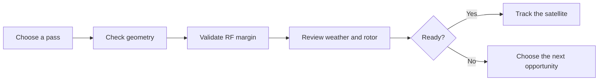

<div align="center">

# SkyComet

### Plan the pass. Validate the link. Track with confidence.

SkyComet is a desktop ground-station workspace for amateur radio satellite operators.
It brings pass prediction, live tracking, RF analysis, space-weather context and rotor
control into one focused application.

[](https://github.com/oguzkabaca/SkyComet/actions/workflows/ci.yml)
[](LICENSE)


</div>

---

## One workspace for the entire satellite pass

Satellite operation usually means moving between prediction websites, Doppler notes,
link-budget spreadsheets, space-weather pages and rotor software. SkyComet keeps that
workflow in one place and answers the question that matters at the station:

> **Is this pass worth tracking, and is the station ready for it?**

| Plan | Evaluate | Track |
|---|---|---|
| See every useful pass on a shared timeline. | Check geometry, RF margin, weather risk and rotor feasibility. | Follow live azimuth, elevation, range, Doppler and rotor state. |

## Product highlights

- **Quick Track** — choose a visible, favorite or planned satellite and start software-only
  or rotor-assisted tracking from one operational screen.
- **All-sky Pass Planner** — inspect the next 24 hours as a satellite-by-satellite schedule,
  filter by pass quality and queue the passes you want to work.
- **Single-satellite analysis** — review pass windows, polar sky tracks, quality scores and
  rotor feasibility in depth.
- **RF Planner** — turn a catalog or custom frequency into a Doppler tuning curve, AOS/TCA/LOS
  guidance and a complete downlink link-budget verdict.
- **Live satellite state** — update azimuth, elevation, range, range rate, altitude and pass phase
  on a 500 ms tracking loop.
- **Catalog and map** — browse more than 2,700 satellites, inspect radio profiles and follow
  ground tracks on an offline-capable world map.
- **Space weather** — bring NOAA/SWPC geomagnetic risk into the same decision surface as the pass.
- **Rotor operations** — configure generic Az-El, Az-only or El-only profiles; analyze slew,
  flip and pre-position feasibility; control GS-232-compatible hardware over serial.
- **Operator Brief** — combine pass geometry, RF margin, space weather and rotor feasibility
  into one readiness score.

## Operator workflow



SkyComet remains useful offline after its embedded catalog has been installed. Network sync
refreshes satellite metadata, TLE data and space weather when a connection is available.

## What makes it different

### Decision-first, not data-first

SkyComet does not stop at drawing an orbit. It connects pass geometry to the rest of the station:
the selected radio mode, expected Doppler, antenna and feed losses, space-weather conditions and
the rotor's real movement limits.

### Built for the operating desk

The interface separates selection, ready, calculating and result states so the operator sees the
next useful action instead of empty charts. Planned passes move directly into Quick Track, and RF
profiles move directly into tuning guidance.

### Local desktop application

The production target is a single Windows executable. Python and Node.js are not required at
runtime, there is no local web server or sidecar process, and operational data stays in a local
SQLite database.

## Project status

SkyComet is currently a **development preview**. The software workflow is feature-complete and is
actively refined through live Windows/WebView2 testing.

- **Automated verification:** 269 unit tests and 2 integration tests, plus `rustfmt`,
  `clippy -D warnings`, ESLint and a production frontend build.
- **Numeric verification:** formulas, constants, tolerances and sanity values are documented in
  [the calculation canon](docs/calculations.md) and covered by regression tests.
- **Platform verification:** Windows is the active development and manual-test platform.
  macOS and Linux builds have not been validated.
- **Hardware verification:** the GS-232 serial backend is covered by mock-transport tests but has
  not yet been validated with a physical rotator. Treat hardware control as experimental.

## Build the development preview

Published installers are not yet the primary distribution path. To run SkyComet from source on
Windows, install:

- [Rust](https://www.rust-lang.org/tools/install) **1.95.0**
- [Node.js](https://nodejs.org/) **22.12.0** and npm
- [Tauri CLI v2](https://v2.tauri.app/start/prerequisites/)
- Visual Studio 2022 Build Tools, Windows SDK and WebView2 Runtime

```powershell
git clone https://github.com/oguzkabaca/SkyComet.git
cd SkyComet

npm install --prefix frontend
cargo install tauri-cli --version "^2"

# Development mode with hot reload
cargo tauri dev

# Production executable and Windows installers
cargo tauri build
```

Development data is stored in `./dev-data/skycomet.db`. Production data is stored in the operating
system's application-data directory; see [the database documentation](docs/03-database.md).

## Quality gate

```powershell
cd src-tauri
cargo fmt --check
cargo clippy --all-targets -- -D warnings
cargo test

cd ../frontend
npm run lint
npm run build
```

## Architecture at a glance

SkyComet is built with **Rust, Tauri v2, React and TypeScript**.

```text
frontend/                 React interface and visualizations
        │ invoke / emit
src-tauri/src/commands/   Tauri IPC boundary
        │
src-tauri/src/core/       Tauri-independent orbit, RF, data and rotor logic
        │
SQLite + external sync    Local runtime state and refreshable public datasets
```

The core does not depend on Tauri. The frontend communicates with the desktop backend only through
typed `invoke` and `emit` messages—there is no REST or WebSocket layer. Read the
[architecture](docs/01-architecture.md), [database policy](docs/03-database.md),
[code conventions](docs/04-conventions.md) and [decision records](docs/decisions/) for details.

## Data sources and attribution

- Orbital elements: [CelesTrak](https://celestrak.org/)
- Satellite and transmitter metadata: [SatNOGS](https://satnogs.org/)
- Space weather: [NOAA Space Weather Prediction Center](https://www.swpc.noaa.gov/)
- World map vectors: [Natural Earth](https://www.naturalearthdata.com/) 110m data, public domain

SkyComet embeds a catalog snapshot so the first useful session does not depend on a successful
network request. Refreshed data remains subject to the availability and terms of its source.

## Contributing

Issues and focused pull requests are welcome. Keep changes aligned with the existing architecture,
include tests for behavior changes and update `docs/calculations.md` in the same commit whenever a
formula, constant or numeric tolerance changes.

## License

SkyComet is released under the [MIT License](LICENSE).

Copyright © 2026 Oğuz Kabaca.
