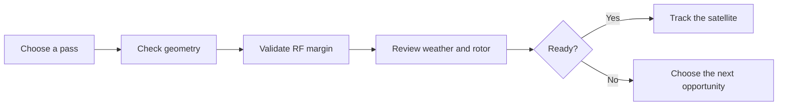
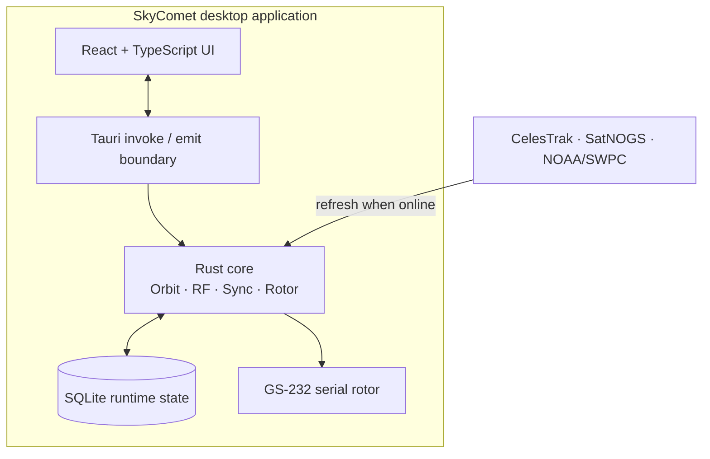
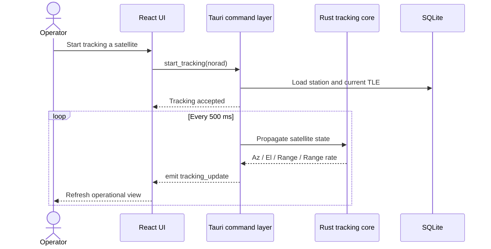

<div align="center">

# SkyComet

### Plan the pass. Validate the link. Track with confidence.

SkyComet is a desktop ground-station workspace for amateur radio satellite operators.
It brings pass prediction, live tracking, RF analysis, space-weather context and rotor
control into one focused application.

[](https://github.com/oguzkabaca/SkyComet/actions/workflows/ci.yml)
[](LICENSE)


</div>

---

## One workspace for the entire satellite pass

Satellite operation usually means moving between prediction websites, Doppler notes,
link-budget spreadsheets, space-weather pages and rotor software. SkyComet keeps that
workflow in one place and answers the question that matters at the station:

> **Is this pass worth tracking, and is the station ready for it?**

| Plan | Evaluate | Track |
|---|---|---|
| See every useful pass on a shared timeline. | Check geometry, RF margin, weather risk and rotor feasibility. | Follow live azimuth, elevation, range, Doppler and rotor state. |

## Product highlights

- **Quick Track** — choose a visible, favorite or planned satellite and start software-only
  or rotor-assisted tracking from one operational screen.
- **All-sky Pass Planner** — inspect the next 24 hours as a satellite-by-satellite schedule,
  filter by pass quality and queue the passes you want to work.
- **Single-satellite analysis** — review pass windows, polar sky tracks, quality scores and
  rotor feasibility in depth.
- **RF Planner** — turn a catalog or custom frequency into a Doppler tuning curve, AOS/TCA/LOS
  guidance and a complete downlink link-budget verdict.
- **Live satellite state** — update azimuth, elevation, range, range rate, altitude and pass phase
  on a 500 ms tracking loop.
- **Catalog and map** — browse more than 2,700 satellites, inspect radio profiles and follow
  ground tracks on an offline-capable world map.
- **Space weather** — bring NOAA/SWPC geomagnetic risk into the same decision surface as the pass.
- **Rotor operations** — configure generic Az-El, Az-only or El-only profiles and analyze slew,
  flip and pre-position feasibility. (GS-232 serial hardware control ships disabled in the alpha
  channel pending physical verification.)
- **Operator Brief** — combine pass geometry, RF margin, space weather and rotor feasibility
  into one readiness score.

## Operator workflow



SkyComet remains useful offline after its embedded catalog has been installed. Network sync
refreshes satellite metadata, TLE data and space weather when a connection is available.

## Usage

1. **Set the station** — save your observer location and station profile in Settings.
2. **Refresh orbital data** — use Catalog sync when a network connection is available.
3. **Choose the opportunity** — scan the all-sky schedule or inspect one satellite in depth.
4. **Validate the station** — review RF margin, space weather and rotor feasibility.
5. **Prepare the target** — add the pass to the plan and open it from Quick Track.
6. **Track** — start software tracking or enable rotor-assisted tracking when hardware is ready.

No API key or `.env` file is required for the core pass-planning, RF and tracking workflow.

## Download

The current release channel is **alpha** (see [CHANGELOG.md](CHANGELOG.md)). Grab the Windows
NSIS installer from the
[latest GitHub Release](https://github.com/oguzkabaca/SkyComet/releases/latest); installed apps
check the same Releases feed for signed self-updates.

> **Alpha channel note:** physical rotor control (serial GS-232) is disabled in alpha builds
> until it has been verified against real hardware. Rotor *analysis* — Operator Brief, pass
> feasibility and rotor profiles — works fully; only the hardware-drive surface is gated off.

## What makes it different

### Decision-first, not data-first

SkyComet does not stop at drawing an orbit. It connects pass geometry to the rest of the station:
the selected radio mode, expected Doppler, antenna and feed losses, space-weather conditions and
the rotor's real movement limits.

### Built for the operating desk

The interface separates selection, ready, calculating and result states so the operator sees the
next useful action instead of empty charts. Planned passes move directly into Quick Track, and RF
profiles move directly into tuning guidance.

### Local desktop application

The production target is a single Windows executable. Python and Node.js are not required at
runtime, there is no local web server or sidecar process, and operational data stays in a local
SQLite database.

## Technology stack

| Layer | Technology | Responsibility |
|---|---|---|
| Desktop shell | Tauri v2 | Native window, lifecycle, IPC and packaging |
| Core | Rust | Orbit propagation, RF analysis, synchronization and rotor logic |
| Interface | React + TypeScript | Operator workflows, state and visualizations |
| Data | SQLite | Local station settings, catalog data, TLEs and runtime metadata |
| Realtime | Tauri `emit` events | 500 ms tracking updates without a local web service |
| External data | CelesTrak, SatNOGS, NOAA/SWPC | Refreshable public orbital, radio and weather data |

## Project status and verification

SkyComet is currently a **development preview**. The software workflow is feature-complete and is
actively refined through live Windows/WebView2 testing.

| Area | Current evidence | Status |
|---|---|---|
| Automated behavior | 280 unit tests + 2 integration tests | Verified in CI |
| Numeric models | Canonical sanity values and regression tests | Verified |
| Windows/WebView2 | Continuous development and live operator review | Verified |
| macOS and Linux | No maintained build or manual validation yet | Unverified |
| Physical GS-232 rotor | Mock-transport and protocol tests only | Disabled in alpha builds |

Formulas, constants, tolerances and sanity values are documented in
[the calculation canon](docs/calculations.md).

## Build the development preview

Prefer the [installer](#download) unless you are changing the code. To run SkyComet from source
on Windows, install:

- [Rust](https://www.rust-lang.org/tools/install) **1.95.0**
- [Node.js](https://nodejs.org/) **22.12.0** and npm
- [Tauri CLI v2](https://v2.tauri.app/start/prerequisites/)
- Visual Studio 2022 Build Tools, Windows SDK and WebView2 Runtime

```powershell
git clone https://github.com/oguzkabaca/SkyComet.git
cd SkyComet

npm install --prefix frontend
cargo install tauri-cli --version "^2"

# Development mode with hot reload
cargo tauri dev

# Production executable and Windows installers
cargo tauri build
```

Development data is stored in `./dev-data/skycomet.db`. Production data is stored in the operating
system's application-data directory; see [the database documentation](docs/03-database.md).

## Deployment

```powershell
cargo tauri build
```

Tauri produces the release executable and Windows installer bundles under
`src-tauri/target/release/bundle/`. Release builds embed the frontend, catalog snapshot and required
application resources; Python, Node.js and a sidecar service are not shipped with the product.

## Quality gate

```powershell
cd src-tauri
cargo fmt --check
cargo clippy --all-targets -- -D warnings
cargo test

cd ../frontend
npm run lint
npm run build
```

## System architecture

SkyComet is built with **Rust, Tauri v2, React and TypeScript**.



The core does not depend on Tauri. The frontend communicates with the desktop backend only through
typed `invoke` and `emit` messages—there is no REST or WebSocket layer. Read the
[architecture](docs/01-architecture.md), [database policy](docs/03-database.md),
[code conventions](docs/04-conventions.md) and [decision records](docs/decisions/) for details.

## Live tracking sequence



The tracking loop copies the active target, releases shared state before propagation and skips
missed ticks instead of accumulating delayed updates.

## Documentation

| Document | Covers |
|---|---|
| [Architecture](docs/01-architecture.md) | Layer boundaries and IPC contract |
| [Database](docs/03-database.md) | Runtime paths, migrations and persistence policy |
| [Conventions](docs/04-conventions.md) | Rust, TypeScript, encoding and repository standards |
| [Calculations](docs/calculations.md) | Numeric formulas, constants, tolerances and sanity values |
| [Decision records](docs/decisions/) | Significant architectural choices and their rationale |

## Roadmap

The numbered implementation phases are complete and SkyComet now evolves through focused product
sprints. Current priorities are:

- validate GS-232 control with a physical Yaesu G-5500-class rotator and re-enable it in
  release builds;
- iterate the alpha release channel toward a stable 0.1.0;
- expand custom RF-profile and generic rotor-profile editing;
- continue operational UI refinement from live pass workflows;
- evaluate macOS and Linux only after the Windows release path is stable.

Roadmap items are directional rather than release promises. Deferred technical decisions are
re-evaluated only when their operational or hardware trigger becomes real.

## Troubleshooting and support

| Symptom | Check |
|---|---|
| No satellites or passes appear | Set a station location, connect once and run Catalog sync to refresh TLE data. |
| RF plan cannot be computed | Choose an RF profile or enter a valid custom downlink frequency. |
| Rotor controls remain unavailable | Physical rotor control is disabled in alpha builds (see [Download](#download)); rotor analysis still works. |
| `cargo tauri` is not recognized | Install Tauri CLI v2 with `cargo install tauri-cli --version "^2"`. |
| Frontend build rejects Node.js | Use the version pinned in `.nvmrc`—currently Node.js 22.12.0. |

For reproducible bugs and feature requests, open a
[GitHub issue](https://github.com/oguzkabaca/SkyComet/issues) with the affected screen, expected
behavior, actual behavior and relevant logs. Do not include API keys, private station details or
serial-device identifiers in public reports.

## Acknowledgments and data sources

- Orbital elements: [CelesTrak](https://celestrak.org/)
- Satellite and transmitter metadata: [SatNOGS](https://satnogs.org/)
- Space weather: [NOAA Space Weather Prediction Center](https://www.swpc.noaa.gov/)
- World map vectors: [Natural Earth](https://www.naturalearthdata.com/) 110m data, public domain

SkyComet embeds a catalog snapshot so the first useful session does not depend on a successful
network request. Refreshed data remains subject to the availability and terms of its source.

## Contributing

Issues and focused pull requests are welcome. Keep changes aligned with the existing architecture,
include tests for behavior changes and update `docs/calculations.md` in the same commit whenever a
formula, constant or numeric tolerance changes.

## Author

Created and maintained by **Oğuz Kabaca**.

## License

SkyComet is released under the [MIT License](LICENSE).

Copyright © 2026 Oğuz Kabaca.
